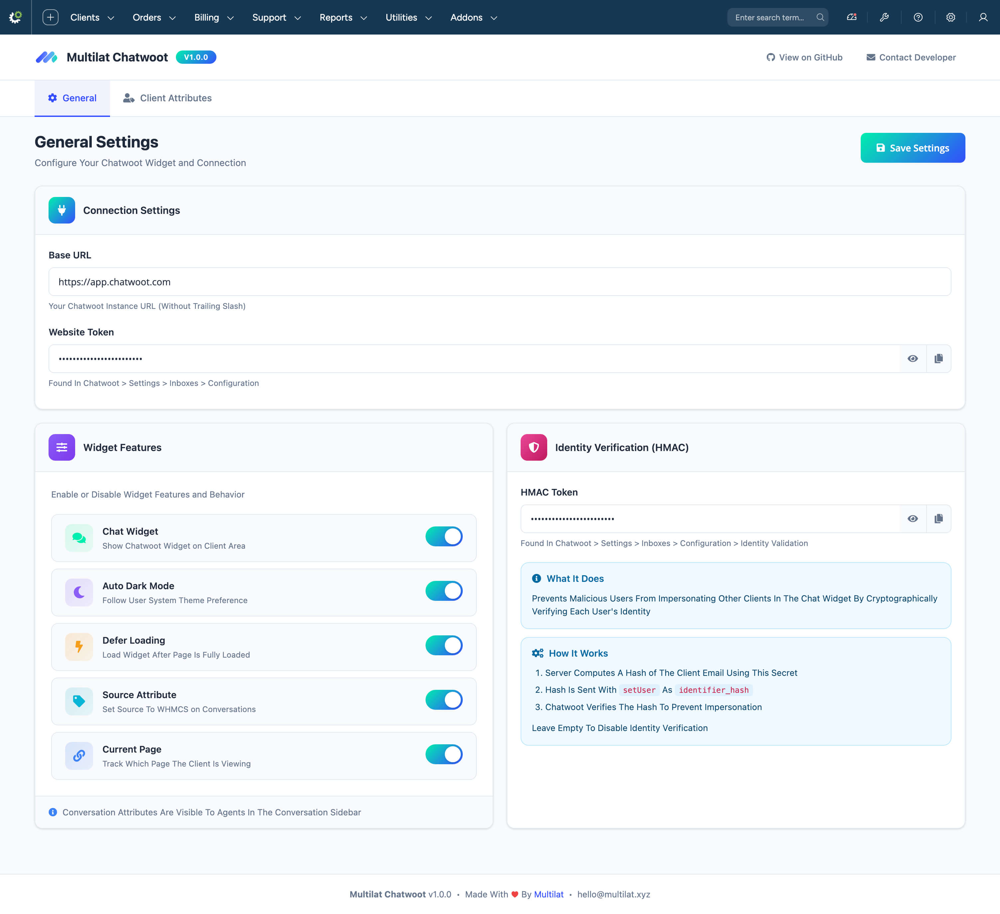
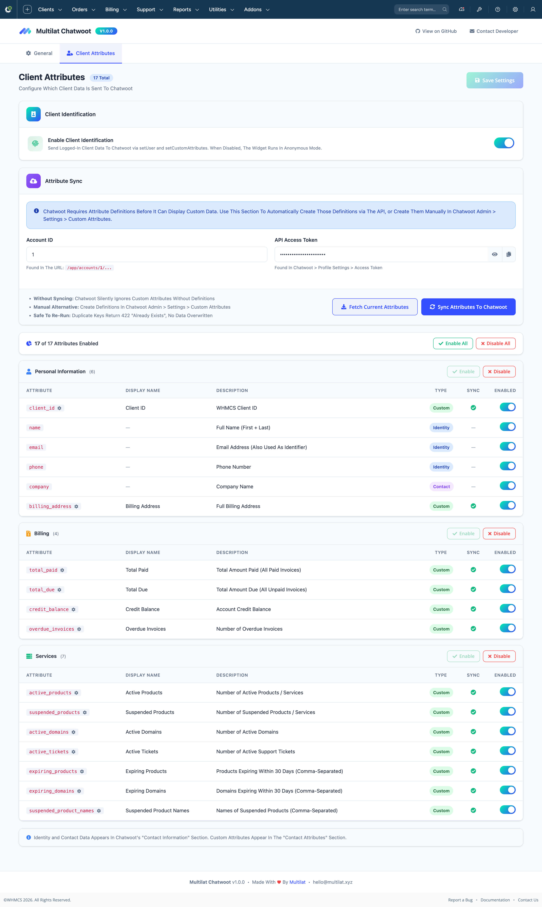

# Chatwoot Live Chat Addon For WHMCS — Multilat Chatwoot

A free, open-source WHMCS addon that adds
[Chatwoot](https://chatwoot.com) live chat widget to your
client area. Automatically identifies logged-in clients,
syncs billing and service data as custom attributes, and
provides HMAC identity verification — so your support
agents see the full customer context in every conversation.





**Compatible With**: WHMCS 8.x — 9.x and Chatwoot 4.x+

## Features

### Client Identification

- Identifies logged-in clients via email in Chatwoot
- Sends name, email, phone (E.164 format), and company
  as native Chatwoot contact fields
- HMAC-SHA256 identity verification to prevent
  impersonation

### Billing Data

- Total paid amount (currency formatted)
- Total due amount (currency formatted)
- Credit balance (currency formatted)
- Overdue invoices count

### Service Tracking

- Active products count
- Suspended products count and names
- Active domains count
- Active support tickets count
- Expiring products within 30 days
- Expiring domains within 30 days

### Conversation Context

- Source attribute (identifies traffic from WHMCS)
- Current page tracking (which page the client is on)

### Attribute Customization

- 19 configurable attributes with per-attribute toggles
- Custom attribute key renaming
- Custom display name overrides
- One-click sync to Chatwoot API
- Fetch existing attributes from Chatwoot
- Live sync status checking on page load

### Widget Options

- Enable/disable chat widget
- Auto dark mode (follows system preference)
- Deferred loading (loads after page ready)

### Admin Interface

- Modern admin panel with tabbed navigation
- Real-time change detection with save indicators
- Secure credential fields (show/hide, copy to clipboard)
- Section-level and individual attribute controls
- Activity logging for all configuration changes

## Requirements

- WHMCS 8.x — 9.x
- A Chatwoot instance (self-hosted or cloud)
- Chatwoot API access token (for attribute sync)

## Install

### Option A: Download ZIP

1. Download the latest release zip
2. Extract `MultilatChatwoot/` to your WHMCS
   `modules/addons/` directory

### Option B: Git Clone

```bash
cd /path/to/whmcs/modules/addons/
git clone https://github.com/multilat/multilat-chatwoot-addon-for-whmcs.git MultilatChatwoot
```

### After Installing

Your directory should look like this:

```text
modules/addons/MultilatChatwoot/
├── MultilatChatwoot.php
├── assets/
├── includes/
├── lib/
└── templates/
```

1. Go to **WHMCS Admin > Setup > Addon Modules**
2. Find **Multilat Chatwoot** and click **Activate**
3. Grant access to the appropriate admin roles

The addon automatically copies the widget hook file
to `includes/hooks/` during activation.

## Configure

### 1. Connection Settings

Go to **Addons > Multilat Chatwoot > General**:

- **Base URL**: Your Chatwoot instance URL
  (e.g., `https://chat.example.com`)
- **Website Token**: Found in Chatwoot under
  Settings > Inboxes > Your Web Widget > Configuration

### 2. Widget Features

Toggle the features you need:

- **Enable Chat Widget**: Master on/off switch
- **Auto Dark Mode**: Widget follows system theme
- **Defer Loading**: Loads widget after page is ready
- **Source Attribute**: Tags conversations as from WHMCS
- **Current Page**: Tracks which page the client is on

### 3. Identity Verification (Optional)

For HMAC-SHA256 identity verification:

1. Get the HMAC token from Chatwoot under
   Settings > Inboxes > Your Web Widget > Configuration
2. Paste it in the **HMAC Token** field
3. Chatwoot will verify that client identity data
   hasn't been tampered with

### 4. Client Attributes

Go to **Addons > Multilat Chatwoot > Client Attributes**:

1. Enable **Client Identification** (master toggle)
2. Select which attributes to send (Personal, Billing,
   Services)
3. Optionally customize attribute keys and display names
4. Enter your **Account ID** and **API Access Token**
5. Click **Sync Attributes To Chatwoot** to create the
   attribute definitions in your Chatwoot instance

## Attribute Reference

### Personal Information

| Attribute | Type | Description |
| ----------- | ------ | ----------- |
| Client ID | Custom | WHMCS client ID |
| Name | Identity | First and last name |
| Email | Identity | Used as Chatwoot identifier |
| Phone Number | Identity | E.164 format with country code |
| Company | Contact | Company name (native field) |
| Billing Address | Custom | Full address concatenated |

### Billing

| Attribute | Type | Description |
| ----------- | ------ | ----------- |
| Total Paid | Custom | Sum of paid invoices |
| Total Due | Custom | Sum of unpaid invoices |
| Credit Balance | Custom | Account credit |
| Overdue Invoices | Custom | Count of overdue invoices |

### Services

| Attribute | Type | Description |
| ----------- | ------ | ----------- |
| Active Products | Custom | Count of active products |
| Suspended Products | Custom | Count of suspended products |
| Active Domains | Custom | Count of active domains |
| Active Tickets | Custom | Count of open tickets |
| Expiring Products | Custom | Names expiring within 30 days |
| Expiring Domains | Custom | Names expiring within 30 days |
| Suspended Product Names | Custom | Names of suspended products |

**Attribute Types:**

- **Identity**: Core contact fields (name, email, phone)
  used by `setUser()`
- **Contact**: Native Chatwoot contact fields (company)
- **Custom**: Custom attributes via
  `setCustomAttributes()`

## Update

1. Download the new release zip
2. Replace the `modules/addons/MultilatChatwoot/`
   directory with the new version
3. Go to **WHMCS Admin > Setup > Addon Modules**
4. The addon runs upgrade routines automatically

## Uninstall

1. Go to **WHMCS Admin > Setup > Addon Modules**
2. Find **Multilat Chatwoot** and click **Deactivate**

The addon removes the widget hook file from
`includes/hooks/` during deactivation. Module settings
are cleaned up from the database.

## Directory Structure

```text
MultilatChatwoot/
├── MultilatChatwoot.php      # Module entry point
├── LICENSE
├── README.md
├── assets/
│   ├── css/
│   │   └── admin.css          # Admin panel styles
│   └── images/
│       ├── author-logo.png
│       └── multilat-logo.png
├── includes/
│   └── hooks/
│       └── multilatchatwoot_widget.php  # Client area hook
├── lib/
│   └── Admin/
│       └── Controller.php     # Admin controller
└── templates/
    └── admin/
        ├── general.php        # General settings page
        ├── attributes.php     # Client attributes page
        └── includes/
            ├── header.php     # Admin layout header
            └── footer.php     # Admin layout footer
```

## License

This project is licensed under the
[MIT License](LICENSE).

## Developer

**Multilat** - Digital Services and Solutions

- Website: [multilat.xyz](https://multilat.xyz)
- Contact: [multilat.xyz/contact](https://multilat.xyz/contact)
- Email: [hello@multilat.xyz](mailto:hello@multilat.xyz)
